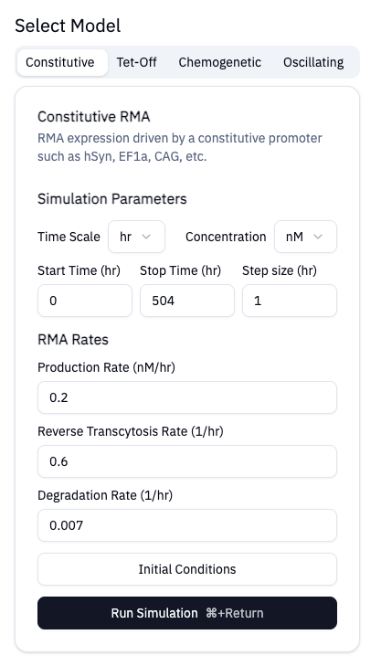
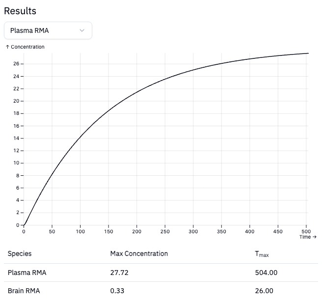

# Application

For users that prefer a graphical interface, both [web](https://nsbuitrago.github.io/rma-kinetics-app) and [desktop](https://github.com/nsbuitrago/rma-kinetics-app/releases) applications are available for running the core models. Both platforms
work the same, with desktop having the added benefit of working offline. The desktop application is available on MacOS and Windows. Pleas see the [installation instructions](./desktop.md) for more details.

## Usage

The graphical applications are the easiest way to quickly test various models.
There may be numerical instability depending on the chosen parameters.
In those cases, we recommend using the Python or Rust libraries directly so you 
can have finer control over the numerical solver tolerances for example.

### Choosing a model

You can select models using the selection tabs. On desktop, you can cycle through
the different models using CMD (on MacOS) or Control (Windows) + numbers 1-4.
As you tap through the model selection tabs, the available parameters for that model
will be displayed. The default parameters are chosen based on common experiments.

### Running Simulations

The `Run Simulation` button will submit a job. For more complex models, you might
experience a small delay as the solver is running. Results will be displayed
when available. By default, the plasma RMA solution will be plotted.

### Help

For any additional help, bug reporting, or feedback, please submit an [issue](https://github.com/nsbuitrago/rma-kinetics-app/issues)
